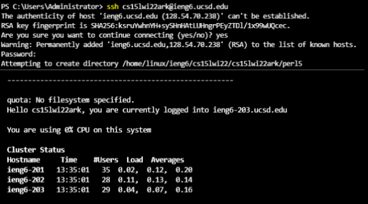
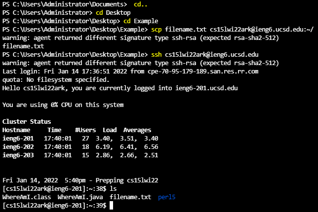

# Remotely Connecting (an epic blog post)

## Installing VSCode
- VSCode can be downloaded at [https://code.visualstudio.com/download](https://code.visualstudio.com/download)
- Click the download button for your type of computer
- Execute the VSCode installer by double clicking it in your downloads folder
- Once installed, VSCode should open to something like this:

## Remotely Connecting
- First, make sure you have OpenSSH installed for both client and server on your computer. 
    - This should only be an issue if you’re on Windows
- Go to Settings > Apps > Apps & Features > Optional Features > Add a feature
    - Install OpenSSH Client and OpenSSH Server
- Next, find your ieng6 account by logging into [https://sdacs.ucsd.edu/~icc/index.php](https://sdacs.ucsd.edu/~icc/index.php)
    - All engineering students’ ieng6 accounts start with “cs15lwi22” and end with different characters, so it’s important to remember the characters after 22
- On VSCode, click the “Terminal” tab at the top, and then click “New Terminal”
- To remotely connect to the ieng6 server, enter this command into the terminal: `ssh cs15lwi22zzz@ieng6.ucsd.edu`
    - Replace the z’s in the command with the characters specific to your account
    - Answer “yes” when it asks if you want to continue connecting.
    - It’s going to ask for your password. By default, your password for this account will still be your ucsd email password

## Trying Some Commands
- Once you’re logged on to the ieng6 account, you can run commands on the server
- Here is a list of basic ssh commands for you to try. They were found at [https://www.hostinger.com/tutorials/ssh/basic-ssh-commands](https://www.hostinger.com/tutorials/ssh/basic-ssh-commands)

- Here is an example of me using some of the commands:

## Moving Files with "SCP"
- Along with being able to login to the server using "ssh", one can also copy files into the server using "scp"
- First, logout of the server by pressing Ctrl + D or closing the terminal
- In the terminal, navigate to the directory of the file you want to copy to the server using `cd directory` and `cd ..`
    - For example, in the following screenshot, my terminal says C:\Users\Administrator\Desktop\Example> 
    - This means I can use scp to send files that are in the folder “Example”, like filename.txt
- Try copying the file to the server using this command: `scp filename.txt cs15lwi22zzz@ieng6.ucsd.edu:~/`
    - Once again, replace the z’s with the specific characters from your account
    - Replace “filename” with the name of your file
    - In this example, I assume you will use a text file (.txt), but you can use almost any filetype

Now you can see this file on the server when you log in using SSH!
Use `ls` once you’re logged in to see if your file copied over

## Setting an SSH Key
- Entering a password everytime you want to use ssh (or scp) can be time consuming, but as you may have noticed in the last picture I don’t have to enter a password every time. This is because I set something up called an “SSH Key”
    - SSH keys work by creating a private “key” on your client and a public “key” on the server. Then when you login with ssh, the server confirms your client using the key instead of a password
- To set up an SSH key, start in the terminal on your client. 
    - Enter the command: `ssh-keygen`
    - When the terminal asks you where to save the key, it will by default suggest: /Users/Username/.ssh/id_rsa
        - (Replace “Username” with the name of your profile on your client)
    - Hit enter without typing anything to use this default directory (recommended)
    - Hit “Enter” twice to confirm an empty password
    - This should generate the key files and a randomart image representing your key; you don’t have to keep track of or worry about this at all.

    - If you’re on a Mac, skip this step. Windows users have to enter these three commands next:
        - #### `Get-Service ssh-agent | Set-Service -StartupType Manual`
        - `Start-Service ssh-agent`
        - `ssh-add C:\Users\Username\\.ssh\id_rsa`

    - Log on to the server using ssh, and run this command: `mkdir .ssh`
    - Finally, logout of the server, and run this command: `scp /Users/Username/.ssh/id_rsa.pub cs15lwi22zzz@ieng6.ucsd.edu:~/.ssh/authorized_keys`
    - Enter you password one last time :)

- If you made it through all those steps, you should be able to ssh and scp in and out of the server without entering a password.

## Optimizing Route Running
- There are a few more optimizations one can make besides SSH Keys involving the use of more efficient commands
- Here are three such examples:
    - One can run multiple commands by separating them with semicolons
        - Ex: `javac Command.java; java Command`
    - One can run a command on the server through ssh without logging in by putting the command after the server ip
        - Ex: `ssh cs15lwi22zzz@ieng6.ucsd.edu ls`
    - One can use quotation marks at the end of an ssh command to run multiple commands on the server without having to log in
        - Ex: `ssh cs15lwi22zzz@ieng6.ucsd.edu “javac Command.java; java Command” `
        - Note: if those files are not already on the server there won’t be anything for the server to run

- These optimizations save valuable time in about the same amount of keystrokes.
    - That last example takes 67 keystrokes to enter into the terminal, in order to run what would otherwise be 4 separate commands.
        - This takes 21.3 seconds to do.
    - To enter those commands commands separately would take 66 keystrokes
        - 'ssh cs15lwi22zzz@ieng6.ucsd.edu' takes 32 keystrokes
        - 'javac Command.java' takes 19 keystrokes
        - 'java Command' takes 13 keystrokes
        - Pressing Ctrl + D (to exit ssh) takes 2 keystrokes
        - Altogether, this takes 24.9 seconds to do.