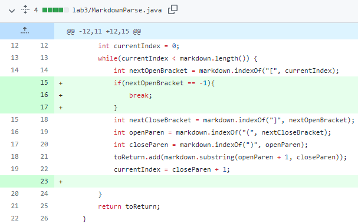
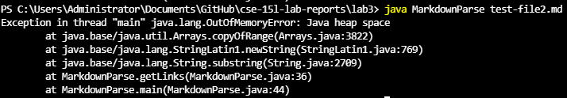
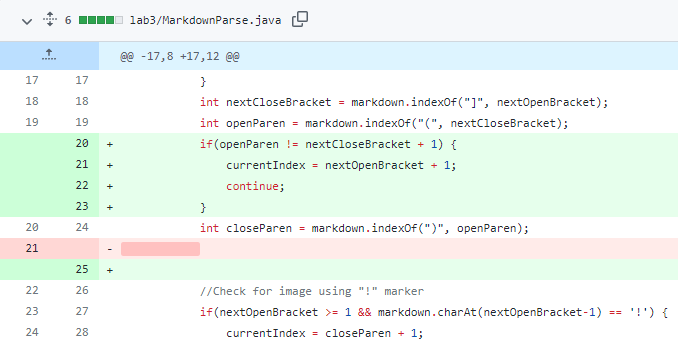
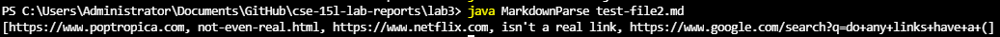
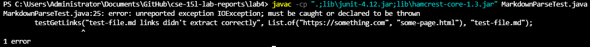
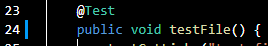

# Lab Report 2 (epic blog post)

## Code Change 1: Fixed Infinite Loop Issue (lab 3)

- [Link to failure-inducing test file](https://raw.githubusercontent.com/ndesopo/cse-15l-lab-reports/main/lab3/test-file2.md)
- Symptom: 
    - 
    - The test file used as input, `testfile-2.md`, contains the following markdown link as its last link:
        - `[big google](https://www.google.com/search?q=do+any+links+have+a+()+in+it&rlz=1C1UEAD_enUS960US960&oq=do+any+links+have+a+()+in+it&aqs=chrome..69i57j33i22i29i30l4.5022j0j9&sourceid=chrome&ie=UTF-8)`
    - Due to this link having a parenthesis within it, the getLinks algorithm for finding a link cuts this link off in the middle of the actual google search link, leaving remaining text after the last bracket of the last link (this bug would also happen as long as there is any text after the last link in the markdown file). Since currentIndex is less than the index of the remaining text, the while loop in getLinks reiterates and searches indefinitely for another link in the remaining text. This eats up all of the heap space causing an OutOfMemoryError.

## Code Change 2: Fixed Brackets Not Used For Links Issue (lab 3)

- [Link to failure-inducing test file](https://raw.githubusercontent.com/ndesopo/cse-15l-lab-reports/main/lab3/test-file2.md)
- Symptom: 
    - 
    - The test file used as input, `testfile-2.md`, contains the following false link:
        - "[this ] (isn't a real link)"
    - Due to the end bracket not being right next to the start parenthesis, this isn't a real markdown link. However, the getLinks algorithm does not check if the end bracket is next to the parenthesis, and instead proceeds under the assumption that all brackets will lead to parenthesis and thus a link. This causes "isn't a real link" to appear in the list of links returned by getLinks, even though it shouldn't be considered a valid link.

## Code Change 3: Adding IOException to JUNIT Tests (lab 4)

In lab 4, my lab group had no bugs due to the actual test files; our only bugs came from creating the tests themselves. I only made 3 very general commits and none were to fix a specific bug, but instead had many changes each. However, between creating the getLinks tests for the first two test files and the following commit, I encountered the error caused by a lack of throwing IOException on JUNIT tests.
!([Screenshot of commit](image5.PNG)
- [Link to failure-inducing test file](https://raw.githubusercontent.com/ndesopo/cse-15l-lab-reports/main/lab4/MarkdownParseTest.java)
- Symptom: 
    - 
    - For this bug, the test files used as input were not the problem; the file containing the tests was.
        - 
    - JUNIT tests depend on IOExceptions to be thrown in their method headers. Thus, a test like this, which lacks "throws IOException" in its method header, causes the unreported IOException. The symptom of this is that the code cannot compile.
