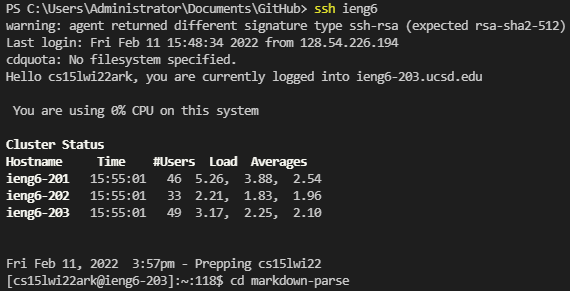

# Copying whole directories with scp -r (an epic blog post)
- You can use `-r` to recursively scp files to a server
- `scp MarkdownParse.java ieng6` would copy just the markdown-parse java file to my ieng6 account
- Alternatively, `scp -r markdown-parse ieng6:~/filename` recursively copies my file into a new directory on the server "filename"
    - Recursive copying means copying the contents inside the markdown-parse directory (including the java file), and if there are any subdirectories within that directory, it recursively copies those as well.
    - I'm using `ieng6` in my command instead of `cs15lwi22ark@ieng6.ucsd.edu` only because I already did another lab option that lets
    me use `ieng6` as a shortcut.

## Copying my whole markdown-parse directory to my ieng6 account
- After navigating to my github repositories folder on my client, I used recursive scp to copy my entire markdown-parse folder to the server

- There were many more files copied but these were the main ones

## Logging into ssh confirms that this directory works like it did on my client
- If I ssh into the ieng6 account, I can compile and run MarkdownParseTest.java to test my MarkdownParse.java file.

## Doing it all at once
- You can actually do all of this at the same time with a combination of `scp`, `ssh`, `;` and `"`
- This is the command I used `scp -r markdown-parse ieng6:~/markdown-parse; ssh ieng6 'cd markdown-parse; javac MarkdownParse.java; javac -cp .:lib/junit-4.12.jar:lib/hamcrest-core-1.3.jar MarkdownParseTest.java; java -cp .:lib/junit-4.12.jar:lib/hamcrest-core-1.3.jar org.junit.runner.JUnitCore MarkdownParseTest`

# Bonus: Set up Github Access from ieng6