# Week 8 Lab Report

Links of relevant markdown-parse repositories:
- My markdown-parse repository: [Long, Easily Clickable Link](https://github.com/ndesopo/markdown-parse)
- The markdown-parse repository I reviewed: [Long, Easily Clickable Link](https://github.com/c1peng/markdown-parse) 

## Easy to screenshot / applicable for all snippets at once
1. Adding tests to each implementation
    - I was able to add the exact same tests to both implementations' MarkdownParseTest.java: 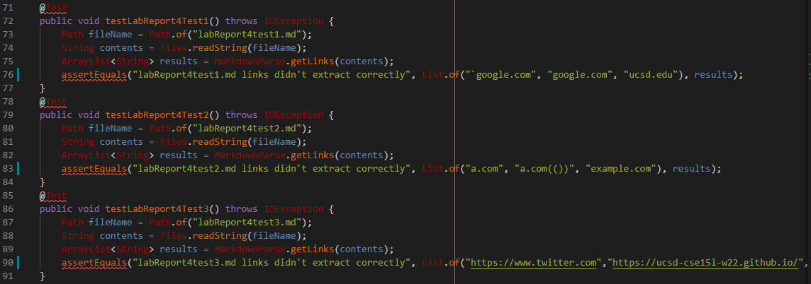
    - Both file structures looked like this: 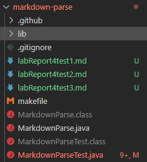
        - `labReport4test` 1 through 3 contained each respective snippet's code
2. On both mine and the other team's implementation of markdown-parse, the three snippets tests' caused three errors: 
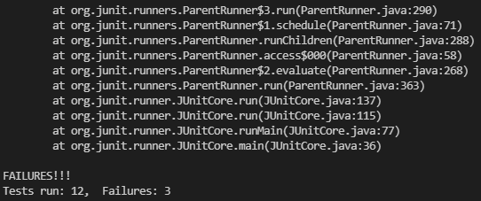
    - More specific errors for each test will be shown below

## Snippet 1
Based on the preview:

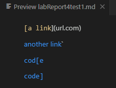

- Snippet 1 should contain the following links:
    - \``google.com`
    - `google.com`
    - `ucsd.edu`
- Failure in my implementation: 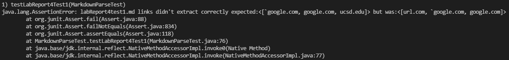
- Failure in the other team's implementation: 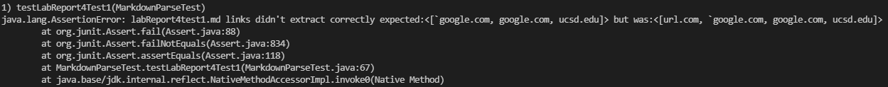

### Could I fix this?
- I believe there is a small change I could make in my code to account for backticks in the inline code by adding more int variables in the getLinks while loop to keep track of open and close backticks. If open backtick was found before the next close bracket and close backtick was found after the next close bracket, or open backtick was found before the next open bracket and close backtick was found after the next open bracket but before the next close bracket, the getLinks while loop would move currentIndex to close backtick + 1.

## Snippet 2
Based on the preview:

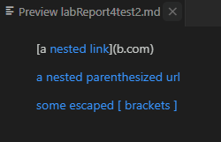

- Snippet 2 should contain the following links:
    - `a.com`
    - `a.com(())`
    - `example.com`
- Failure in my implementation: 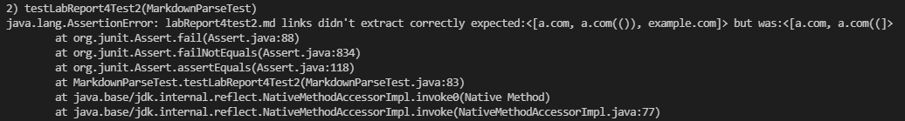
- Failure in the other team's implementation: 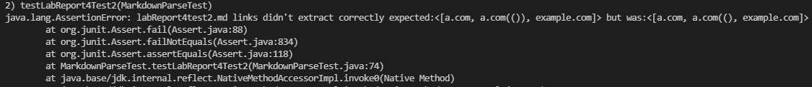

### Could I fix this?
- I believe there is a big (over 10 lines) change I could make in my code to account for nested brackets and parenthesis in my code. I would have to restructure my code to account for "layers" of opened and closed brackets/parenthesis by adding counters and adding/subtracting when a bracket or parenthesis opened/closed a new layer.

## Snippet 3
Based on the preview:

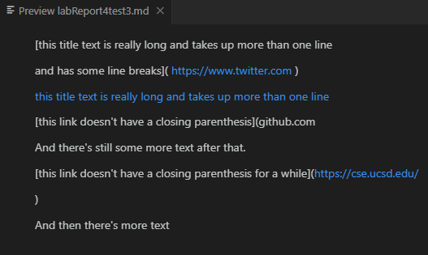

- Snippet 3 should contain the following links:
    - `https://www.twitter.com`
    - `https://ucsd-cse15l-w22.github.io/`
    - `https://cse.ucsd.edu/`
- Failure in my implementation: 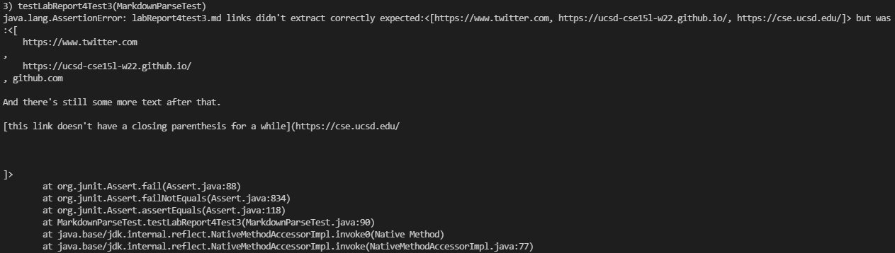
- Failure in the other team's implementation: 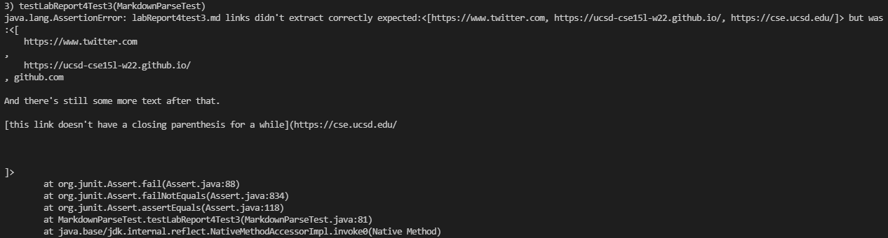

### Could I fix this?
- I believe there is a small change I could make in my code to account for newlines found within links. I can simply use the String.trim() method to remove the newlines and spaces in valid links. As long as my program recognizes the correct links, this should format them into just the link itself.