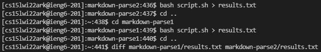
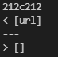
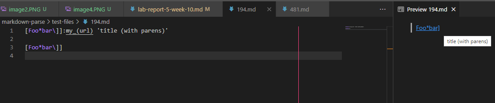
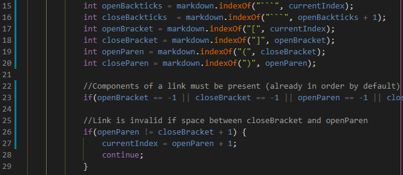
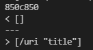
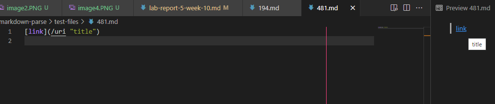
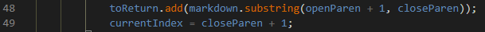

# Lab Report 5

In lab 9, two of many things we learned was how to write an output to a file using `bash script.sh > filename.txt` and how to compare the lines of two files using `diff file1.txt file2.txt`. This is also exactly how I went about comparing the given implementation of markdown-parse and my implementation of markdown-parse for this lab report.

- The given implementation is markdown-parse1
- My implementation is markdown-parse2

Two differences between my implementation of markdown-parse and the implementation given in lab 9 occurred on lines 212 and 850. I went to lines 212 and 850 and found that they corresponded to tests 194 and 481 respectively.

## Test 194

- The given implementation produced the link:
    - `url`
- My implementation produced no links

- From the preview we see that this test file contains only one, correct link:
    - `title (with parens)`
    - This indicates that neither my implementation nor the given implementation produced the correct result for this test. 
- The bug here in my code is that I only check for links contained in the format `[text](www.url.com)`. A possible fix I could implement for the format of the link shown in test 194 is checking for a colon after the square brackets followed by apostrophes containing the link. Below is an example of the flaw in my code:

    - This code never creates an int to store the index of a colon, nor checks for a colon after the closeBracket. 

## Test 481

- The given implementation produced no links
- My implementation produced the link:
    - `/uri "title"`

- From the preview we see that this test file contains only one, correct link:
    - `title`
    - This indicates that neither my implementation nor the given implementation produced the correct result for this test. 
- The bug here in my code is that everything inside the parenthesis is assumed to be a link when in fact the link may only be contained within quotation marks if they can be found inside the parentheses. A fix would be to check if there are two quotation marks, openQuotationMark and closeQuotationMark, inside the parentheses. If there are, only the text between them would be the link. Below is an example of the flaw in my code:

    - This code incorrectly adds the text between the parentheses even if there are quotation marks found in between.